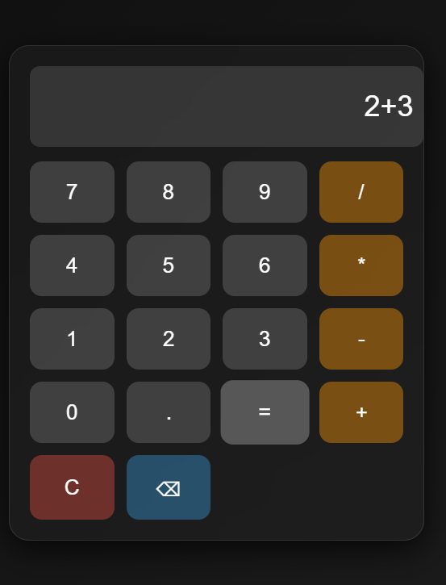

# Modern Glass-Effect Calculator

A stylish and functional calculator built using **HTML**, **CSS**, and **JavaScript**.  
This calculator supports basic operations like addition, subtraction, multiplication, and division, and includes keyboard support.

## ✨ Features
- Glassmorphism design with smooth animations  
- Responsive layout  
- Supports mouse clicks and keyboard input  
- Basic math operations: `+`, `-`, `*`, `/`  
- Clear (C) and backspace (⌫) buttons  

## 📸 Preview
 <!-- optional if you add a screenshot -->

## 🚀 Live Demo
[Click here to use the calculator](https://Sneha-Padma.github.io/OIBSIP/Calculator/)

## 🛠️ Technologies Used
- HTML5  
- CSS3 (Glassmorphism, Grid layout, animations)  
- JavaScript (DOM manipulation, event listeners)

## 📂 Project Structure
calculator/
│── index.html # HTML structure
│── style.css # Styling & animations
│── script.js # Calculator functionality

## 📜 License
This project is open source and available under the [MIT License](../LICENSE).
